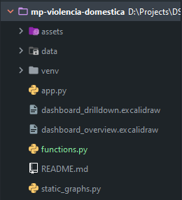
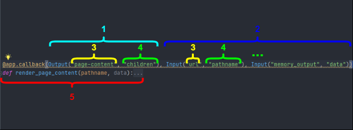

# Technical Documentation

## Code Organization

#### **Assets Folder**

**Styles Documents** - CSS document with the app styles.

This folder also contains other files, like images, used on the dashboard.

#### **Data Folder**

Folder to store the data used on the dashboard.

### **Main File**

#### **app.py**

Main file of project. Dashboard code, 

### **Auxiliary files**

The goal of these files is to make the code more clean, understandable, and readable.  

#### **functions.py**

Python file with auxiliary functions used on **app.py**. In this file, we can write generic functions, e.g. for data preparation.

#### **dashboard_components.py**

In this project, we have a set of components that we don't have any callback related, so we can write all the code in this file and use it on the **app.py**. But we also can develop functions that receive a set of parameters and return different values for a dynamic dashboard.

---

## @app.callback

1. Output that will be changed when this callback is executed;
2. Inputs property that this callback will be watching, whenever an input property changes, the function that the callback decorator wraps will get called automatically. Dash provides the function with the new value of the input property as an input argument and Dash updates the property of the output component with whatever was returned by the function;
3. Component Id;
4. Component Propriety;
5. Function that will return the value that will update the component property, defined on the output.